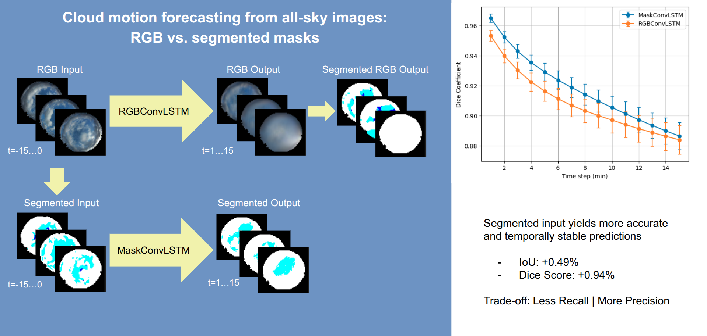

# SkyMaskConvLSTM

Multi-frame cloud prediction in all-sky images from RGB images and segmented masks

## Abstract

This paper presents a comparative study on the impact of input representation on
deterministic artificial intelligence models for short-term multi-frame prediction in all-sky
images. This work compares a model operating on 8-bit RGB all-sky images with a
model that shares the same backbone, but operating directly on semantically
segmented masks that encode cloud-related classes. Using an available sky
segmentation model, predictions are evaluated in the segmentation label space using
segmenter-derived masks as a proxy reference. Within this evaluation framework, the
use of semantic masks as input for short-term prediction leads to improved temporal
stability and higher agreement across standard segmentation metrics such as
intersection over union, Dice coefficient, and categorical cross-entropy. While these
results suggest potential relevance for weather and solar energy nowcasting
applications, further validation against physical irradiance measurements is required.

## Acknowledgments

* [github.com/ndrplz/ConvLSTM_pytorch](https://github.com/ndrplz/ConvLSTM_pytorch)
